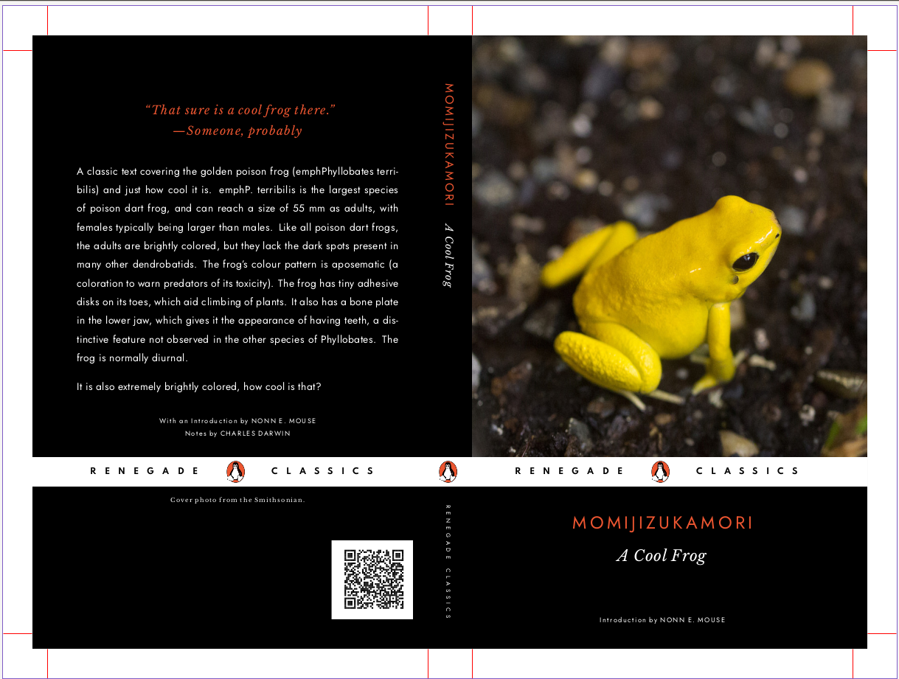

A loving pastische/recreation of the modern Penguin Classics cover style in LaTeX. This template should be compiled using Lualatex or Xelatex for the `fontspec` package. Fonts you will need installed are [Libre Baskerville](https://fonts.google.com/specimen/Libre+Baskerville), [Jost](https://fonts.google.com/specimen/Jost), and [Spartan](https://fonts.google.com/specimen/Spartan), all available for free from Google Fonts (optionally, you can skip Spartan and replace it's reference with Jost, but it won't look as nice).

**Credits for the Demo Verion**  
* [Photo of a Golden Poison Frog from the Smithsonian](https://www.si.edu/object/golden-poison-frog:nzp_NZP-20160226-311CTW), available under a CC0 (public domain) licsence  
* Some text from the [Wikipedia article on the Golden Poison Frog](https://en.wikipedia.org/wiki/Golden_poison_frog), available under a CC BY-SA 3.0 license
* Tux imprint icon created from (Tux-icon-mono.svg on Wikimedia Commons)[https://commons.wikimedia.org/wiki/File:Tux-icon-mono.svg], based on the original Tux design by Larry Ewing - this icon is marked CC0 but Larry Ewing's stipulation on the original icon is that is free for any use ['provided you acknowledge me lewing@isc.tamu.edu and The GIMP if someone asks'](https://isc.tamu.edu/~lewing/linux/)