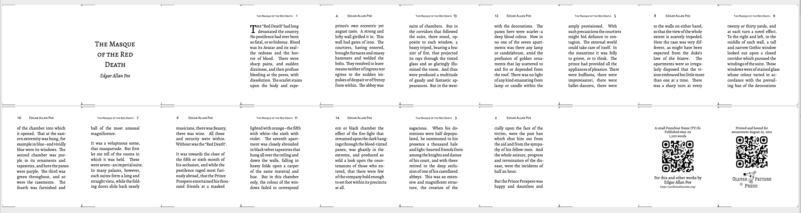

## LaTeX

Actually-- I use [TeXShop](https://pages.uoregon.edu/koch/texshop/) for all my TeX related needs on my Mac. Because I've imported fonts via the `fontspec` (I think?) I need to use **XeLaTeX** to typeset (not the default but available in the dropdown... I assume it came with the default installation tho?)

Note that I use the same QR code in the sample file twice and it point to my Tumblr. It's an example- you're supposed to change things before you actually print it/use it. 

## Imposition 

Gotta' call the imposition script like so: 

```
./signature_creator_20.sh PDF_FILEN_NAME PAGE_COUNT FILLER_PAGE_NUMBER "{135cm,17cm}"
PDF_FILEN_NAME - easiest if you just drop the PDF in the same directory as the script
PAGE_COUNT - max number of pages in your generated PDF
FILLER_PAGE_NUMBER - I just need blank page to use as filler, it's dumb. Sorry. Tell me a page number

ex: 
./signature_creator_20.sh mini_book_base.pdf 50 2 "{135cm,17cm}"
```

This will drop a series of PDF rows in a directory named `output_20`. Each PDF there is 2 pages and a row of 10 pages, made of of 5 folios across 2 signatures. Because there's 50 pages and rows are 20 pages there's 3 files generated (the last made half of blanks). 



I'm lazy and stitch them together by hand, something like:

```
pdfjam --landscape --nup 1x6 output_20/temp_sig_0.pdf '1' output_20/temp_sig_20.pdf '1' output_20/temp_sig_40.pdf '1' output_20/temp_sig_0.pdf '1' output_20/temp_sig_20.pdf '1' output_20/temp_sig_40.pdf '1'  output_20/temp_sig_0.pdf '2' output_20/temp_sig_20.pdf '2' output_20/temp_sig_40.pdf '2' output_20/temp_sig_0.pdf '2' output_20/temp_sig_20.pdf '2' output_20/temp_sig_40.pdf '2' --outfile output_20/book.pdf

```

You can fit up to 6 rows per sheet face.  Note the above does 2 copies of the same 3 files. 

When printing, be sure to always print on the "Short Side" 

Cut the long rows, look at pages, fold them up. It's a weird 2/3 folio per strip. I don't snip them while I'm working though it does mean a stitched book is not fully openable until you trim the fore-edges open. 